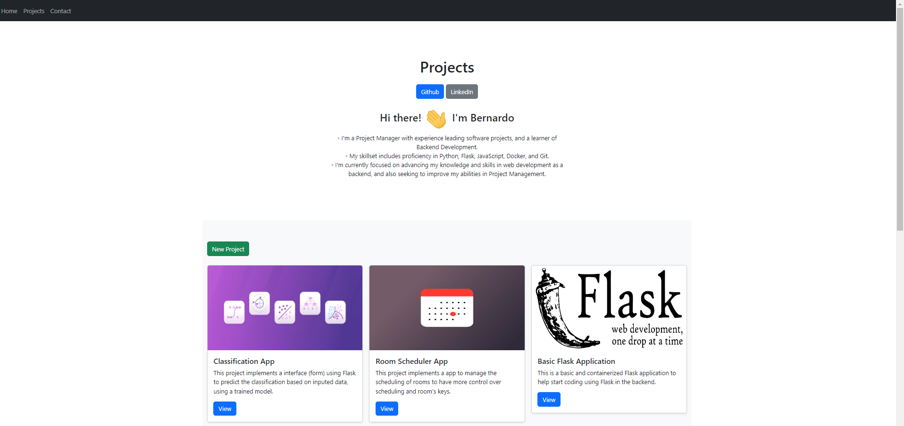

# Basic Flask Application
This is a basic Django application to help start coding using Django in the backend.
This project includes a simple implementation of a projects portfolio to show your works.

Warning: If you want to see projects in projects page, you need to create new registers of projects using [Admin](http://localhost:8000/admin) interface.

### Technologies
- Python + Django
- Sqlite3

### How to run the Django application
> Run the following commands in the root directory.
**Command:**
- Create virtual environment: `python -m venv .venv`
- Activate the virtual environment: `source .venv/bin/activate`
- Install the dependencies: `pip install -r requirements.txt`
- Start App: `python manage.py runserver`

**Migrations**
> - Run the following lines when needs to manage migrations:
- `python manage.py makemigrations [app]`: to generate a migration.
- `python manage.py migrate [app]`: to apply the generated migrations.

### **URLs**
- Django App: http://localhost:8000/
- Admin: http://localhost:8000/admin

### Resources
- [Django](https://www.djangoproject.com/)
- [Bootstrap](https://getbootstrap.com/)
- [Jinja](https://jinja.palletsprojects.com/en/3.1.x/)